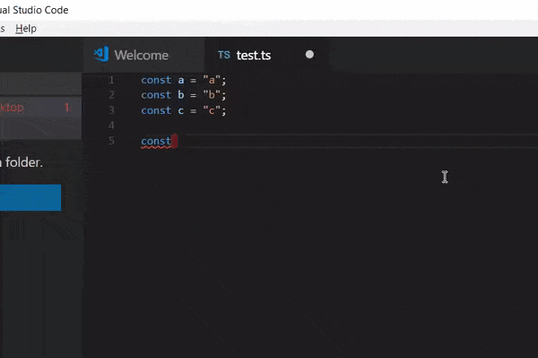

# Convert js/ts strings to templates and insert arguments automatically

**Template Strings** converts current string (where your cursor is) to template and inserts argument to current position.

## Features

* Converts current string to template
* Adds argument to current position

## Requirements

No anything special, just VS Code

## Extension Settings

No settings so far

## Release Notes

### 1.0.0
